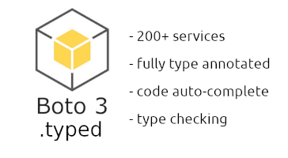
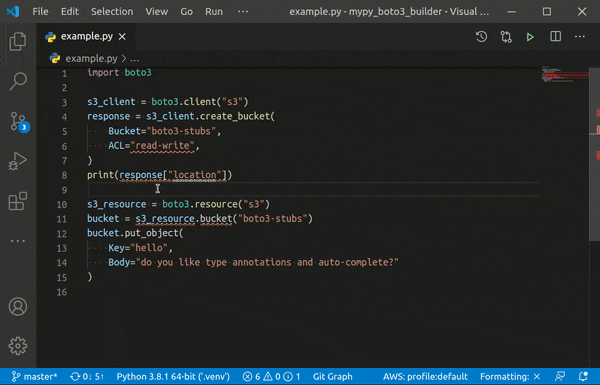

# mypy_boto3_builder

[](https://pypi.org/project/mypy-boto3-builder)
[](https://pypi.org/project/boto3-stubs)
[](https://pypi.org/project/boto3)

[](https://mypy-boto3-builder.readthedocs.io/)
[](https://pypi.org/project/boto3-stubs/)
[](https://pypi.org/project/boto3-stubs/)

[](https://pypi.org/project/boto3-stubs)
[](https://codecov.io/gh/vemel/mypy_boto3_builder)
[](https://pypistats.org/packages/boto3-stubs)



Type annotations builder for [boto3-stubs](https://pypi.org/project/boto3-stubs/) project. Compatible with [mypy](https://github.com/python/mypy), [pyright](https://github.com/microsoft/pyright), [VSCode](https://code.visualstudio.com/), [PyCharm](https://www.jetbrains.com/pycharm/) and other tools.

See how it helps to find and fix potential bugs:



- [mypy_boto3_builder](#mypy_boto3_builder)
  - [Using boto3-stubs](#using-boto3-stubs)
  - [How to build type annotations](#how-to-build-type-annotations)
    - [Locally](#locally)
    - [With Docker image](#with-docker-image)
  - [Known issues](#known-issues)
    - [PyCharm consumes too much CPU](#pycharm-consumes-too-much-cpu)
  - [Versioning](#versioning)
  - [Latest changes](#latest-changes)
  - [Thank you](#thank-you)

## Using boto3-stubs

Check [boto3-stubs](https://pypi.org/project/boto3-stubs/) project for installation
and usage instructions.

If you use up-to-date `boto3` version, just install corresponding `boto3-stubs` and start
using code auto-complete and `mypy` validation. You can find instructions on
[boto3-stubs](https://pypi.org/project/boto3-stubs/) page.

This page is only for building type annotations manually. For example, if you want to
use the latest features for an older `boto3` version.

## How to build type annotations

### Locally

```bash
# Install preferred version of `boto3`
python -m pip install boto3==1.16.25 botocore==1.19.25

# Install `mypy-boto3-builder`
python -m pip install mypy-boto3-builder

# Build all packages in mypy_boto3_output directory
python -m mypy_boto3_builder mypy_boto3_output

# Or specify required services explicitly
python -m mypy_boto3_builder mypy_boto3_output -s ec2 s3

# Install custom `boto3-stubs` packages
cd mypy_boto3_output
pip install mypy_boto3_ec2_package
pip install mypy_boto3_s3_package
pip install boto3_stubs_package
```

### With Docker image

- Install [Docker](https://docs.docker.com/install/)
- Pull latest `mypy_boto3_builder` version and tag it

```bash
docker pull docker.pkg.github.com/vemel/mypy_boto3_builder/mypy_boto3_builder_stable:latest
docker tag docker.pkg.github.com/vemel/mypy_boto3_builder/mypy_boto3_builder_stable:latest mypy_boto3_builder
```

- Generate stubs in `output` directory

```bash
mkdir output

# generate stubs for all services
docker run -v `pwd`/output:/output -ti mypy_boto3_builder

# generate stubs for s3 service
docker run -v `pwd`/output:/output -ti mypy_boto3_builder -s s3

# generate stubs for a specific boto3 version
docker run -e BOTO3_VERSION=1.16.25 BOTOCORE_VERSION=1.19.25 -v `pwd`/output:/output -ti mypy_boto3_builder
```

- Install packages from `output` directory as described above

## Known issues

### PyCharm consumes too much CPU

PyCharm does not handle `Literal` overloads properly, so the only way to reduce CPU usage is to generate
overloads only for services you use

```bash
# got to your project folder, activate venv

# install boto3-stubs as usual with services you need
pip install 'boto3-stubs[s3,ec2]'

# install mypy_boto3_builder
pip install mypy_boto3_builder

# generate boto3 stubs only with services in use, s3 and ec2 in this case
# stubs should be generated in <project_root>/typings/boto3
python -m mypy_boto3_builder --installed --skip-services typings -d -s s3 ec2
```

Add `<project_root>/typings` folder to your [Interpreter Paths](https://www.jetbrains.com/help/pycharm/stubs.html#reuse-stubs)

Autocomplete should work now and do not stress your CPU. Still, try to avoid generation
for 6 or more services, as it is still stressful for PyCharm. In this case, generate `boto3-stubs`
for a couple of services and use explicit type annotations for the rest.

Since stubs are stored in your project root, you do not need to re-generate them after update.

## Versioning

`mypy_boto3_builder` version is not related to `boto3` version and follows
[PEP 440](https://www.python.org/dev/peps/pep-0440/).

## Latest changes

Full changelog can be found in [Releases](https://github.com/vemel/mypy_boto3_builder/releases).

## Thank you

- @alliefitter for [boto3-type-annotations](https://pypi.org/project/boto3-type-annotations/),
  this package is based on top of his work
- [black](https://github.com/psf/black) developers for an awesome formatting tool
- @timothycrosley for [isort](https://github.com/PyCQA/isort) and how flexible it is
- [mypy](https://github.com/python/mypy) for doing all dirty work for us
- [pyright](https://github.com/microsoft/pyright) team for the new era of typed Python
